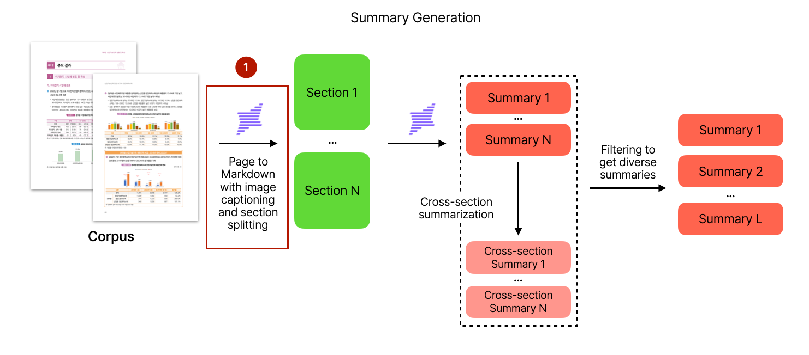
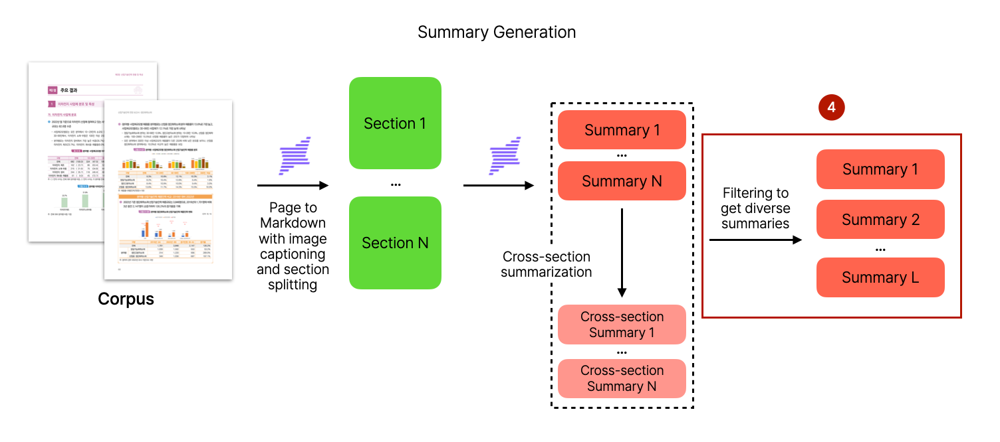
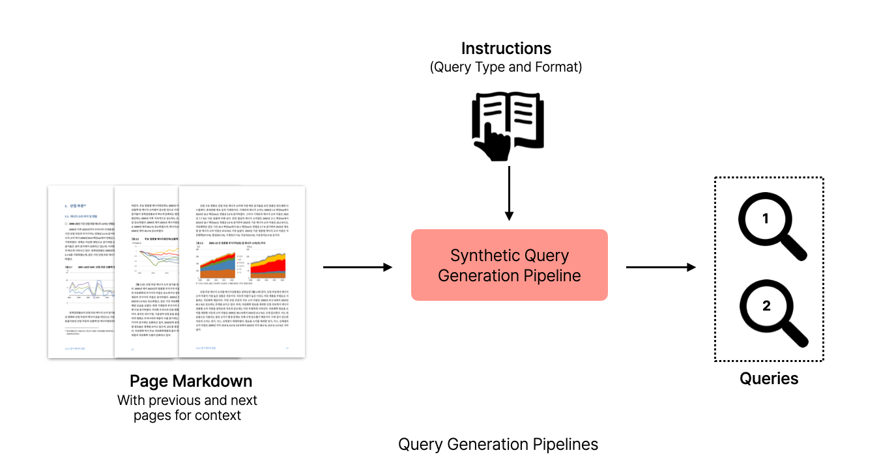
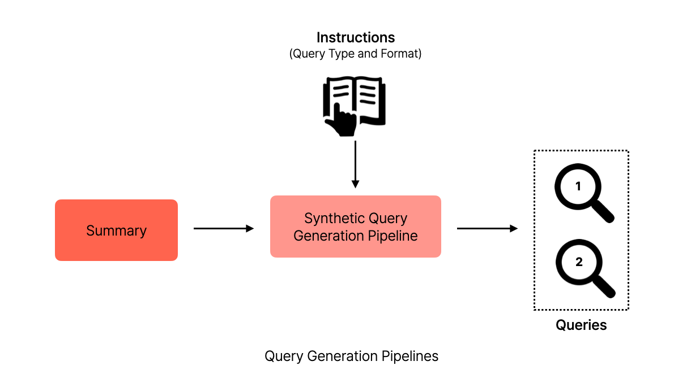
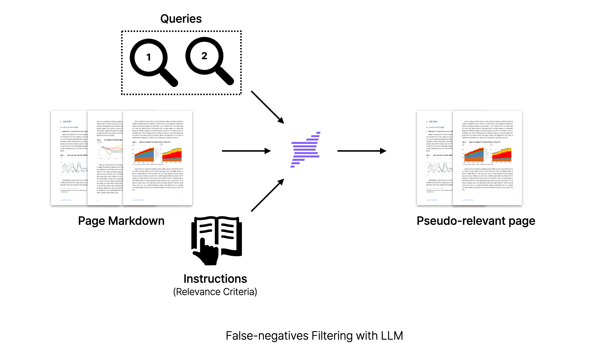

# Pipeline Overview

This document describes the synthetic data generation pipeline for KoViDoRe v2.

## Pipeline Architecture

The pipeline consists of three main stages:

1. **Corpus Building** - Convert PDF documents to structured markdown
2. **Summary Generation** - Generate single and cross-section summaries
3. **Query Generation** - Generate synthetic queries from context or summaries
4. **False Negative Filtering** - Filter out false negative pages for each query

---

## Stage 0: Corpus Building

Convert PDF documents to page-level markdown with image captioning and section splitting.



**Command:**
```bash
python build_corpus.py --subsets {subset}
```

**Process:**
1. Convert each PDF page to image
2. Parse images using Upstage Document Parser
3. Extract markdown content and section elements
4. Save as corpus parquet file

**Output:** `data/{subset}/corpus/data.parquet`

---

## Stage 1: Summary Generation

### 1-1. Single Section Summary

Generate summaries for each individual section.


**Command:**
```bash
bash scripts/run.sh --subsets {subset} --task single_section_summary
```

**Process:**
1. Explode corpus by section elements
2. Generate summary for each section using LLM

**Output:** `data/{subset}/single_section_summary/`

---

### 1-2. Cross Section Summary

Combine multiple sections and generate cross-section summaries.


**Command:**
```bash
bash scripts/run.sh --subsets {subset} --task cross_section_summary
```

**Process:**
1. Randomly combine 3, 5, or 7 sections per document
2. Generate cross-section summaries that synthesize information across sections

**Output:** `data/{subset}/cross_section_summary/`

---

### 1-3. Filtering Summaries (Optional)

Filter summaries to ensure diversity.



> **Note:** This step was not used in the current pipeline. Instead, diverse summaries were considered during the query quality control process.

---

## Stage 2: Query Generation

Two approaches for generating synthetic queries:

### 2-1. Query from Context

Generate queries directly from page markdown with surrounding context.



**Command:**
```bash
bash scripts/run.sh --subsets {subset} --task query_from_context
```

**Process:**
1. Create sliding windows of 5 or 7 consecutive pages
2. Generate queries that require information from multiple pages

**Output:** `data/{subset}/query_from_context/`

---

### 2-2. Query from Summary

Generate queries from cross-section summaries.



**Command:**
```bash
bash scripts/run.sh --subsets {subset} --task query_from_summary
```

**Process:**
1. Use cross-section summaries as input
2. Generate queries based on synthesized information

**Output:** `data/{subset}/query_from_summary/`

---

## Stage 3: False Negative Filtering

Filter out false negative pages for each query type (query_from_context, query_from_summary).



**Command:**
```bash
# Filter false negatives for queries from context
bash scripts/run.sh --subsets {subset} --task filter_query_from_context

# Filter false negatives for queries from summary
bash scripts/run.sh --subsets {subset} --task filter_query_from_summary
```

**Process:**
1. For each query, check relevance against all corpus pages using LLM
2. Identify pages that could incorrectly answer the query (false negatives)
3. Filter out these false negative pages from the relevance set

**Output:** `data/{subset}/filter_query_from_context/` or `data/{subset}/filter_query_from_summary/`

---

## Directory Structure

```
data/{subset}/
├── pdfs/                          # Place PDF files here before running the pipeline
├── images/                        # Generated page images from PDFs
├── corpus/
│   └── data.parquet               # Parsed corpus data
├── seed/                          # Preprocessed seed files for each task
│   ├── seed_for_single_section_summary.parquet
│   ├── seed_for_cross_section_summary.parquet
│   ├── seed_for_query_from_context.parquet
│   ├── seed_for_query_from_summary.parquet
│   ├── seed_for_filter_query_from_context.parquet
│   └── seed_for_filter_query_from_summary.parquet
├── single_section_summary/        # Pipeline output
├── cross_section_summary/         # Pipeline output
├── query_from_context/            # Pipeline output
├── query_from_summary/            # Pipeline output
├── filter_query_from_context/     # Pipeline output
└── filter_query_from_summary/     # Pipeline output
```

> **Note:** Before running the pipeline, place your PDF files in `data/{subset}/pdfs/` directory.

---

## Model Provider Configuration

You can customize model providers in `src/kovidore_data_generator/config.py`:

```python
from data_designer.essentials import ModelProvider, ModelConfig, ChatCompletionInferenceParams

# Define a new provider
custom_provider = ModelProvider(
    name="custom",
    endpoint="https://api.custom-provider.com/v1",
    api_key="CUSTOM_API_KEY",  # Environment variable name
)

# Add to model_providers list
model_providers = [upstage_provider, openai_provider, custom_provider]

# Define model configuration
model_configs = [
    ModelConfig(
        alias="custom-model",           # Use this alias with --model_alias flag
        model="model-name",             # Actual model name from the provider
        provider="custom",              # Must match provider name
        inference_parameters=ChatCompletionInferenceParams(
            max_tokens=4096,
            temperature=0.7,
            top_p=0.9,
        ),
    ),
]
```

**Usage:**
```bash
bash scripts/run.sh --subsets {subset} --task {task} --model_alias custom-model
```

---

## Full Pipeline Execution

```bash
# 1. Build corpus
uv run python build_corpus.py --subsets {subset}

# 2. Summary generation
bash scripts/run.sh --subsets {subset} --task single_section_summary
bash scripts/run.sh --subsets {subset} --task cross_section_summary

# 3. Query generation (choose one or both)
bash scripts/run.sh --subsets {subset} --task query_from_context
bash scripts/run.sh --subsets {subset} --task query_from_summary

# 4. False negative filtering
bash scripts/run.sh --subsets {subset} --task filter_query_from_context
bash scripts/run.sh --subsets {subset} --task filter_query_from_summary

# 5. Quality control (manual review)
```
