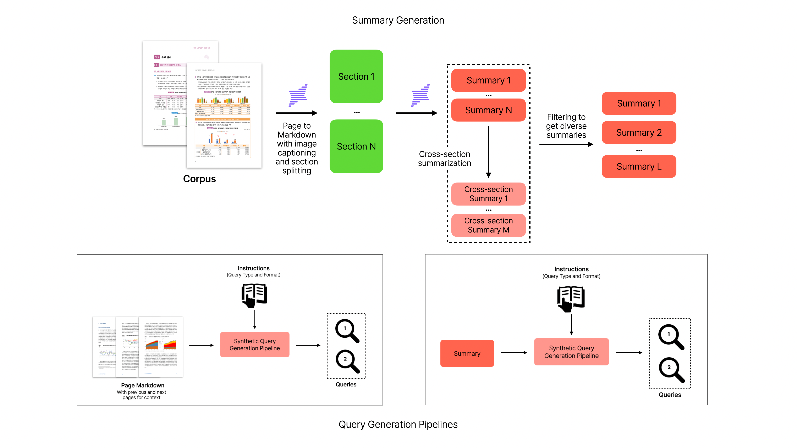

# KoViDoRe Data Generator
Synthetic data generation pipeline for KoViDoRe benchmark

## Overview


**KoViDoRe Data Generator** is a synthetic data generation pipeline designed to construct the [KoViDoRe v2](https://huggingface.co/collections/whybe-choi/kovidore-benchmark-beir-v2) benchmark for evaluating Korean Vision Document Retrievers. Inspired by [ViDoRe V3](https://huggingface.co/blog/QuentinJG/introducing-vidore-v3), this pipeline addresses a key limitation of KoViDoRe v1—single-page matching—by generating queries that require synthesizing information across multiple pages rather than retrieving answers from a single page in isolation. Furthermore, this pipeline can be utilized to synthesize training datasets specifically for Korean Vision Document Retrieval.

## Pipeline

The pipeline consists of four main stages: corpus building, summary generation, query generation, and false negative filtering. For detailed documentation, see [PIPELINE.md](PIPELINE.md).

## Installation

```bash
uv sync
source .venv/bin/activate
```
## Quick Start

1. **Export your Upstage API key**
    ```bash
    export UPSTAGE_API_KEY=your_upstage_api_key_here
    ```

2. **Build the corpus from PDF documents**
    ```bash
    python build_corpus.py --subsets cybersecurity
    ```

3. **Run the pipeline for the target task**
    ```bash
    # KoViDoRe v2 followed the process below:

    # -----------------------------------------------
    # 1. generate query from cross-section summary
    # -----------------------------------------------
    # 1-1. generate single-section summary based on corpus
    bash scripts/run.sh --subsets cybersecurity --task single_section_summary

    # 1-2. generate cross-section summary based on single-section summary
    bash scripts/run.sh --subsets cybersecurity --task cross_section_summary

    # 1-3. generate query from cross-section summary
    bash scripts/run.sh --subsets cybersecurity --task query_from_summary

    # 1-4. filter false negatives with LLM
    bash scripts/run.sh --subsets cybersecurity --task filter_query_from_summary

    # -----------------------------------------------
    # 2. generate query from context
    # -----------------------------------------------
    # 2-1. generate query from context
    bash scripts/run.sh --subsets cybersecurity --task query_from_context

    # 2-2. filter false negatives with LLM
    bash scripts/run.sh --subsets cybersecurity --task filter_query_from_context

    # -----------------------------------------------
    # 3. quality control and audit checks (by human)
    # -----------------------------------------------
    ```

## Datasets

[KoViDoRe v2](https://huggingface.co/collections/whybe-choi/kovidore-benchmark-beir-v2) includes four subsets, each focusing on a distinct, enterprise-relevant domain:

| Subset | Description | Link |
|--------|-------------|------|
| **HR** | Workforce outlook and employment policy | [🤗 Dataset](https://huggingface.co/datasets/whybe-choi/kovidore-v2-hr-beir) |
| **Energy** | Energy policy and power market trends | [🤗 Dataset](https://huggingface.co/datasets/whybe-choi/kovidore-v2-energy-beir) |
| **Economic** | Quarterly economic trend reports | [🤗 Dataset](https://huggingface.co/datasets/whybe-choi/kovidore-v2-economic-beir) |
| **Cybersecurity** | Cyber threat analysis and security guides | [🤗 Dataset](https://huggingface.co/datasets/whybe-choi/kovidore-v2-cybersecurity-beir) |

## License

MIT

## Acknowledgements

This pipeline is inspired by the [ViDoRe V3](https://huggingface.co/blog/QuentinJG/introducing-vidore-v3), and we thank the original authors for their foundational work. We also extend our gratitude to the [NVIDIA NeMo Data Designer](https://github.com/NVIDIA-NeMo/DataDesigner) team for open-sourcing their library. Finally, We thank the [Upstage x AWS AI Initiative](https://www.upstage.ai/events/ai-initiative-2025-ko) for granting us free access to their API services.

We also acknowledge the datasets provided by the [Public Data Portal(공공데이터포털)](https://www.data.go.kr/index.do), which were utilized to construct the tasks in KoViDoRe v2.

## Contact

For questions or suggestions, please open an issue on the GitHub repository or contact the maintainers:

- [Yongbin Choi](https://github.com/whybe-choi) - whybe.choi@gmail.com

## Citation

If you use KoViDoRe v2 in your research, please cite as follows:
```bibtex
@misc{choi2026kovidorev2,
  author = {Yongbin Choi},
  title = {KoViDoRe v2: a comprehensive evaluation of vision document retrieval for enterprise use-cases},
  year = {2026},
  url = {https://github.com/whybe-choi/kovidore-data-generator},
  note = {A benchmark for evaluating Korean vision document retrieval with multi-page reasoning queries in practical domains}
}
```